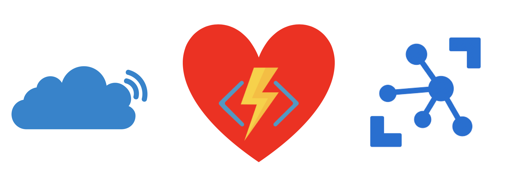

# The Things Network Integration for Azure IoT Hub

This is an Integration App for [The Things Network](www.thethingsnetwork.org) (TTN) Applications with [Azure IoT Hub](azure.microsoft.com/services/iot-hub) which is based on [Azure Functions](azure.microsoft.com/services/functions).

Basically this Integration translates the protocols of The Things Network and Azure IoT. It listens for events from a Things Network Application (e.g. Device created, Device deleted, Device to Clound Message) and forwards them to an Azure IoT Hub. It is also planned to implement forwarding of events from an Azure IoT Hub to a TTN Application (e.g. Device created, device deleted, Cloud to Device Message), but this is not implemented yet.

# Usage

To use this Integration you need the following things:

- A The Things Network Application. When deploying the Integration you need the Application ID as well as the Application Access Key which can be retrieved from the TTN concole page for your Application.
- An Azure IoT Hub. You can create such an IoT Hub in the Azure Portal. For the deployment of the Integration you'll need the Connection String for the "iothubowner" which can be found in the "Shared access policy" section of the IoT Hub settings.

Regarding the deployment of the Integration there are multiple options:

- Using the "Deploy to Azure" button below might be the easiest way. Clicking this button will open a custom deployment template in the Azure Portal where you can insert the necessary information (see above). After confirmation an Azure Functions App will be created automatically and the Integration App will be deployed. After the deployment process has been finished, the Integration App is ready to forward events from your TTN Application to the Azure IoT Hub.
- You can create the Function App manually using the Azure Portal and then deploy the Integration App using e.g. the [Azure Function Tools for Visual Studio Code](https://docs.microsoft.com/en-us/azure/azure-functions/functions-create-first-function-vs-code). Therefore you'll have to checkout the code from this repostitory, open the project in Visual Studio Code, connect your manually create Azure Functions App in the Azure Functions Tools for Visual Studio code and the use its deployment functionality to deploy the Integration App. The required information (see above) can be entered in the "Application Settings" section in the Azure Functions Tools for Visual Studio Code (the names of the App Settings Keys are: *TTNAppID*, *TTNAppKey* and *AzureIotHubConnectionString*).

# WARNING

**Using the "Deploy to Azure" button will allow you to deploy this Integration (which is an Azure Functions App essentially) to an Azure Resource Group of your choice. Please be aware that during the deployment process an App Service Instance will be created which uses the "Basic" App Service Plan as the minimum Service Plan. This App Service Plan is associated with a monthly subscription cost. More info can be found [here](https://azure.microsoft.com/en-us/pricing/details/app-service/windows/). The reason for using the "Basic" App Service Plan as a minimum is the requirement to keep the Azure Function App running constantly because it listens to incoming MQTT packets from the The Things Network Data API. Functions Apps running on the "Consumption" Plan will be shut down automatically after 10 minutes and the connection to the Data API of TTN will be lost. Running Functions Apps on the "Free" and "Shared" App Service Plans is currently not possible. So, you have been warned! If you're still eager to try this Integration, hit the "Deploy to Azure" button below. Have fun!**
 
